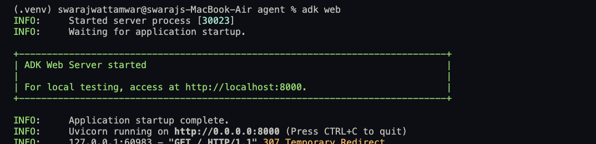
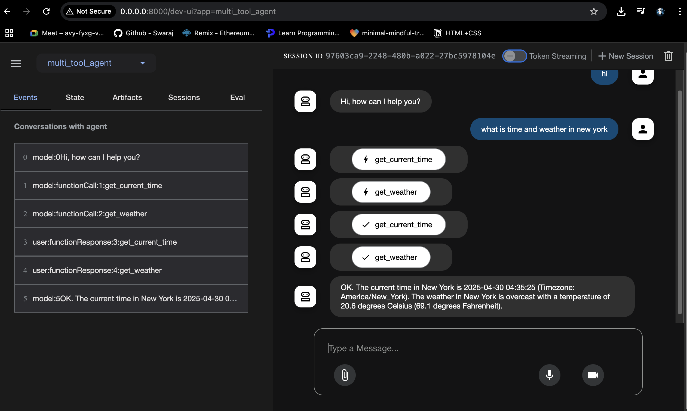

# Prerequisites: 
1. Install python
2. Have an IDE

Steps:
1. Set up the python environment

- Initialize .vnev `python -m venv .venv`

- Activate virtual env

    - Activate (each new terminal)

    - macOS/Linux: source .venv/bin/activate

    - Windows CMD: .venv\Scripts\activate.bat

    - Windows PowerShell: .venv\Scripts\Activate.ps1


2. `pip install google-adk`
3. Have the following project structure
```
parent_folder/
    multi_tool_agent/
        __init__.py
        agent.py
        .env
```
4. Defined root agent and start integrating tools and services!
5. Run project with `adk web`

### Once Prerequisites are Done, Type `adk web`:


### ADK UI

The ADK UI provides a user-friendly interface for interacting with the agent and its services.

 

You can access the UI by running the project and navigating to the provided URL in your browser.

